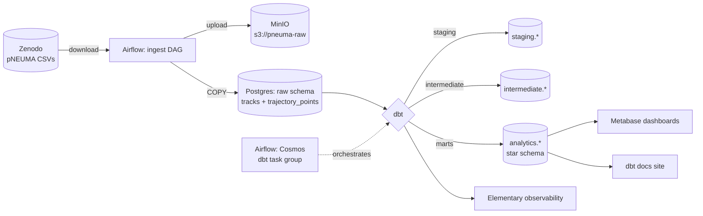
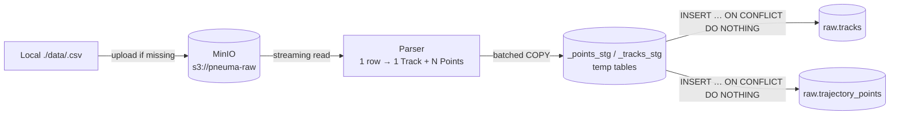

# Architecture

## Overview

This is an **ELT** (Extract → Load → Transform) data warehouse over the pNEUMA dataset. The defining feature of the source data is that each row in the raw CSV represents a single vehicle's entire trajectory — 4 fixed columns followed by **N × 6** repeating columns (one block of `lat, lon, speed, lon_acc, lat_acc, time` per recorded frame). Different rows have different N values, which makes the ingest the most interesting engineering problem in the pipeline.

## Component map

## Ingest flow

The pNEUMA CSV format is the most unusual engineering problem in the pipeline. Each row in a source file represents an entire vehicle's trajectory — 4 header columns followed by `N × 6` repeating per-frame columns, with **`N` different for every row**. A naive `pd.read_csv` fails on the very first parse because the column count is non-uniform.

The ingest module solves this with a streaming line-by-line parser. For each vehicle it emits one `Track` record (the header) and `N` `TrajectoryPoint` records, normalising the input into two tidy tables.

Two design choices worth calling out:

- **Temp staging + `ON CONFLICT DO NOTHING`** instead of one-row-at-a-time INSERT. COPY into a transient table is ~50× faster than row-by-row inserts, and the conflict clause keyed on `(source_file, track_id, frame_idx)` makes re-runs of the same file idempotent.
- **`source_file` is part of every primary key.** Multiple pNEUMA files can coexist in the same `raw.*` tables — the file name itself is the lineage. Removing data for a single ingest run is `DELETE … WHERE source_file = '…'`.

The DAG (`airflow/dags/ingest_pneuma.py`) is a thin TaskFlow wrapper: it pulls config from environment variables and calls `ingest.pipeline.run_ingest()`. Nothing in `ingest/` imports Airflow, which means the whole pipeline is exercisable in plain pytest without spinning up the stack.

## Layered design

| Layer | Schema | Purpose |
|-------|--------|---------|
| **Raw** | `raw` | Loaded as-is from source. Append-only. Never touched by analysts. |
| **Staging** | `staging` | 1:1 with raw, but cleaned, renamed, typed. dbt models. |
| **Intermediate** | `intermediate` | Reusable derived logic (segments, idle detection, speed buckets). dbt models. |
| **Marts** | `analytics` | Star schema for consumption. dbt models. |

## Service topology

The full stack runs under one `docker compose` file (`infra/docker-compose.yml`). Components and how they connect:

| Service | Image | Host port | Container role |
|---|---|---|---|
| `postgres` | `postgres:16-alpine` | `5432` | Hosts three databases: `warehouse` (the DWH), `airflow_meta`, `metabase_meta`. |
| `airflow-apiserver` | custom `pneuma-dwh/airflow` | `8080` | Airflow 3 REST API + web UI. |
| `airflow-scheduler` | custom | — | Picks tasks off the queue, runs them locally (LocalExecutor). |
| `airflow-dag-processor` | custom | — | New in Airflow 3 — parses DAG files in its own process. |
| `airflow-triggerer` | custom | — | Runs deferrable-operator triggers. |
| `airflow-init` | custom (one-shot) | — | Runs `airflow db migrate` and creates the admin user, then exits. |
| `minio` | `minio/minio` | `9000`/`9001` | S3-compatible object store. Bucket `pneuma-raw`. |
| `minio-init` | `minio/mc` (one-shot) | — | Creates the raw bucket on first boot. |
| `metabase` | `metabase/metabase` | `3000` | BI dashboards. Stores its own state in `metabase_meta`. |

The custom Airflow image (`infra/airflow/Dockerfile`) is `apache/airflow:3.2.1-python3.11` with `dbt-core`, `dbt-postgres`, `astronomer-cosmos`, and `boto3` baked in. Building deps at image-build time (rather than via `_PIP_ADDITIONAL_REQUIREMENTS` at container start) keeps boots fast and reproducible.

### Role boundaries inside Postgres

| Role | Owns | Reads from | Writes to |
|---|---|---|---|
| `warehouse` | `warehouse` DB + `raw` schema | — | `raw.*` |
| `dbt_dev` | `staging`, `intermediate`, `analytics` schemas | `raw.*` | `staging.*`, `intermediate.*`, `analytics.*` |
| `metabase_ro` | — | `analytics.*` | — |
| `airflow` | `airflow_meta` DB | — | `airflow_meta.*` |
| `metabase` | `metabase_meta` DB | — | `metabase_meta.*` |

This separation means a leaked Metabase password can't write to the warehouse, and a leaked ingest password can't touch Airflow's metadata.

## Environment separation

Three dbt targets share one Postgres instance, separated by schema prefix. The
`generate_schema_name` macro in `dbt/dwh/macros/` is what implements this — it
overrides dbt's default schema-naming rule so prod uses the bare schema names
that Metabase and downstream consumers can rely on.

| Target | Used by | Schema pattern |
|--------|---------|----------------|
| `dev` | Developer laptop | `dbt_dev_<schema>` |
| `ci` | GitHub Actions | `dbt_ci_<schema>` |
| `prod` | Airflow scheduled runs | `<schema>` (no prefix) |

Promotion happens by running dbt under the target — not by copying data between databases. dbt selects the target via the `DBT_TARGET` env var; the same `profiles.yml` is used in every context.

## Open design questions

- **Trajectory-point volume.** pNEUMA's largest row has roughly 20,000 points and a single file contains ~922 rows, so the trajectory table will sit at tens of millions of rows per ingested file. The dbt incremental strategy has to avoid full scans on every run.
- **Geographic indexing.** PostGIS for spatial queries vs. plain lat/lon with a BRIN index — to be decided once we have real query patterns from the dashboard layer.
- **Partitioning.** Whether `fct_trajectory_points` should be partitioned by area/date for query pruning depends on the dashboard SQL we end up writing.
