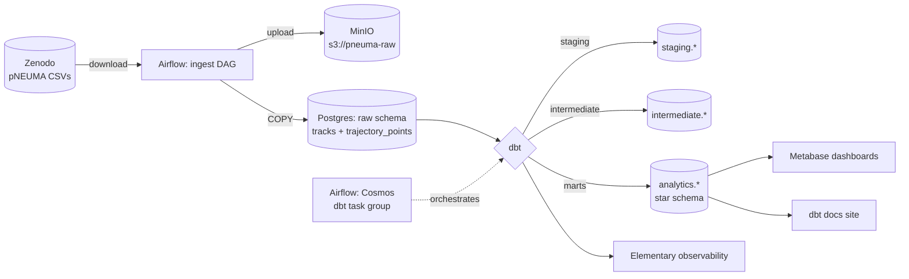

# Architecture

## Overview

This is an **ELT** (Extract → Load → Transform) data warehouse over the pNEUMA dataset. The defining feature of the source data is that each row in the raw CSV represents a single vehicle's entire trajectory — 4 fixed columns followed by **N × 6** repeating columns (one block of `lat, lon, speed, lon_acc, lat_acc, time` per recorded frame). Different rows have different N values, which makes the ingest the most interesting engineering problem in the pipeline.

## Component map

## Layered design

| Layer | Schema | Purpose |
|-------|--------|---------|
| **Raw** | `raw` | Loaded as-is from source. Append-only. Never touched by analysts. |
| **Staging** | `staging` | 1:1 with raw, but cleaned, renamed, typed. dbt models. |
| **Intermediate** | `intermediate` | Reusable derived logic (segments, idle detection, speed buckets). dbt models. |
| **Marts** | `analytics` | Star schema for consumption. dbt models. |

## Environment separation

Three dbt targets share one Postgres instance, separated by schema prefix:

| Target | Used by | Schema pattern |
|--------|---------|----------------|
| `dev` | Developer laptop | `dev_<schema>` |
| `ci` | GitHub Actions | `ci_<schema>` |
| `prod` | Airflow scheduled runs | `<schema>` (no prefix) |

Promotion happens by running dbt under the target — not by copying data between databases.

## Open design questions

- **Trajectory-point volume.** pNEUMA's largest row has roughly 20,000 points and a single file contains ~922 rows, so the trajectory table will sit at tens of millions of rows per ingested file. The dbt incremental strategy has to avoid full scans on every run.
- **Geographic indexing.** PostGIS for spatial queries vs. plain lat/lon with a BRIN index — to be decided once we have real query patterns from the dashboard layer.
- **Partitioning.** Whether `fct_trajectory_points` should be partitioned by area/date for query pruning depends on the dashboard SQL we end up writing.
